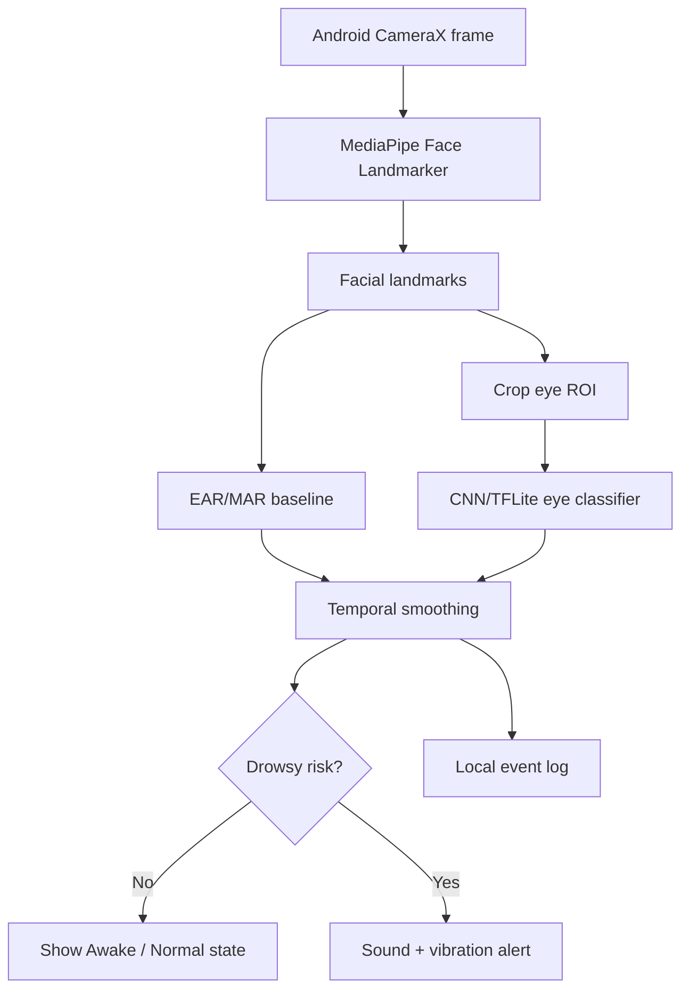

# Deployment Architecture And Practical Value

## Why Android Phone Is A Reasonable Deployment Target

An Android phone can act as both camera and edge AI device:

- camera for cabin-facing video;
- CPU/GPU/NPU for MediaPipe and TensorFlow Lite;
- screen for visual feedback;
- speaker/vibration for warnings;
- storage for local event logs;
- optional network for syncing summaries later.

This is more practical than a laptop webcam demo because the device is small,
cheap, widely available, and can be mounted inside a vehicle.

## Proposed Architecture

## Deployment Modes

| Mode | Description | Best for | Trade-off |
|---|---|---|---|
| Personal phone demo | User mounts phone and runs the app | Student demo, individual drivers | Manual setup |
| Android box in vehicle | Dedicated Android device with cabin camera | Taxi, bus, delivery fleet prototype | Needs hardware setup |
| Hybrid logging | AI runs on-device, only events are uploaded | Organizations needing summaries | Requires privacy policy |
| Research prototype | Phone collects controlled test data | Class/research validation | Not road-certified |

## Practical Value

### Individuals

- Low-cost warning aid for long drives.
- No need for special hardware beyond a phone.
- Can work offline because inference is on-device.

### Transport Organizations

- Prototype for driver fatigue monitoring in taxi, bus, delivery, or logistics
  fleets.
- Can log only events instead of continuous video, reducing storage and privacy
  risk.
- Provides a basis for future driver-safety dashboards.

### Schools And Research Groups

- Demonstrates edge AI deployment using Android, MediaPipe, and TensorFlow Lite.
- Gives students a complete pipeline from data to model to mobile deployment.
- Encourages safety-oriented evaluation such as recall/F1 instead of only
  accuracy.

### Community

- Raises awareness of fatigue-related driving risk.
- Encourages accessible assistive safety tools.
- Shows that AI projects should consider deployment, privacy, and limitations,
  not only model accuracy.

## Privacy And Safety Principles

1. **On-device first**

   Process camera frames on the phone. Avoid uploading raw face video unless
   there is a clear reason and explicit consent.

2. **Event logging instead of continuous recording**

   If logs are needed, store timestamps, state, confidence, and FPS. Avoid saving
   face images by default.

3. **User consent**

   The driver should know when the camera is active and what data is stored.

4. **Safety framing**

   The system is an assistive warning prototype, not a certified vehicle safety
   system and not a replacement for rest or responsible driving.

5. **Bias and robustness disclosure**

   Report limitations with lighting, glasses, sunglasses, face shape, head pose,
   camera position, and dataset diversity.

## How This Answers Research Gaps

| Gap | Project response |
|---|---|
| Offline-only evaluation | Android CameraX live pipeline and FPS overlay |
| Laptop-only demo | Android phone as camera + compute device |
| Heavy models not suited for edge | Small CNN/TFLite and ROI-based inference |
| Accuracy-only reporting | Recall/F1 and confusion matrix for eyes_closed/drowsy |
| Poor explainability | EAR/MAR baseline plus CNN label/confidence |
| Privacy concerns | On-device processing and event-only logging proposal |

## Future Product Roadmap

Short term:

- Train and integrate `drowsiness_model.tflite`.
- Add demo video and FPS measurement.
- Add simple local log screen. The prototype already logs minimal drowsy/yawning
  events to app-internal CSV without storing raw video.

Medium term:

- Add PERCLOS, head pose, and gaze direction.
- Add per-driver threshold calibration.
- Test across lighting, glasses, and phone positions.

Long term:

- Android box/camera version for fleets.
- Privacy-preserving event dashboard.
- Controlled real-vehicle validation with safety supervision.
